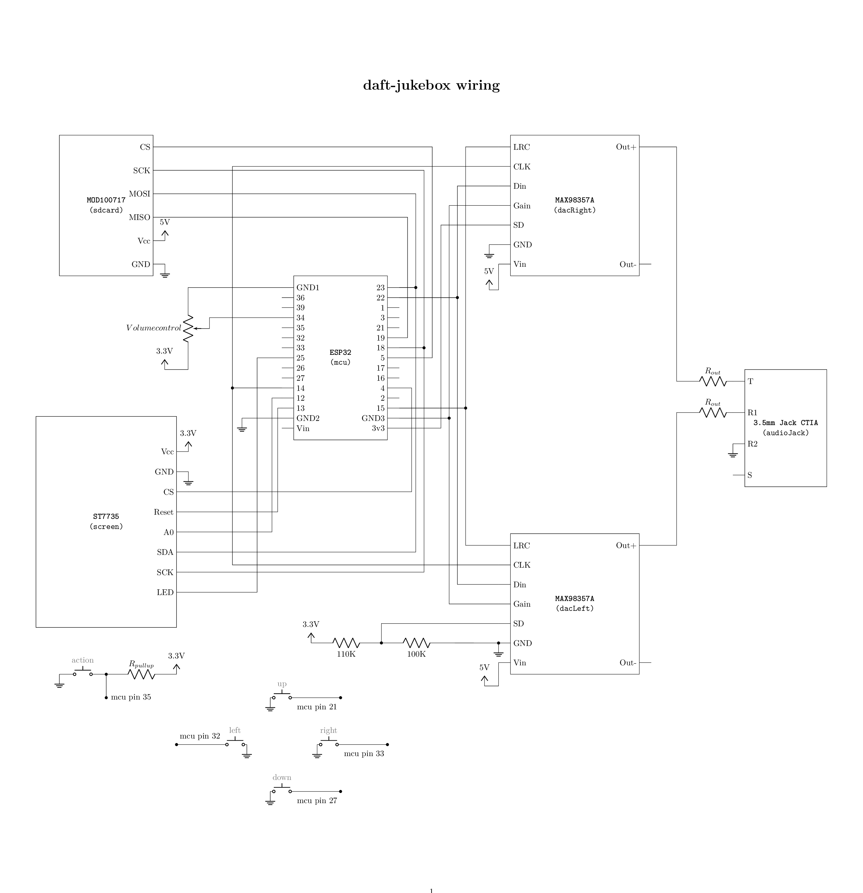

# Daft jukebox
Daft (_dumb as fuck tech_) jukebox is an mp3 player powered by esp32

### Ingredients
- ESP32 board
- 2 MAX98357A digital-to-analog converter (any i2s DAC)
- ST7735 lcd display (any SPI display)
- SD card module (Eg: MOD100717) (any SPI sd card reader)
- SDHC card
- TRRS 3.5mm jack female connector (or wire it directly to stereo speakers)
- Potentiometer for volume control
- Push buttons for controls
- Boost converter for battery from 3.7v to 5v
- LiPo battery 3.7v
- Overcharge+Overdischarge protection board for the battery (if battery doesn't include it)
- Resistors: 110K, 100K, ...

---

### Wiring
[tex](./wiring/wiring.tex) | [pdf](./media/wiring.pdf)

> [My notes](./Notes.md)

